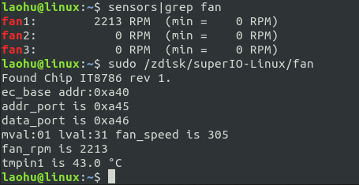

# IT87 SUPERIO FAN

Read CPU fan speed with superIO in Linux

Chip model: **ITE8786E-I,** use superio to read the value of the fan register, and then calculate the speed according to the formula provided in the chip manual

**build**

```
gcc fan_super.c -o fan
```

**run**

```
sudo ./fan
```




